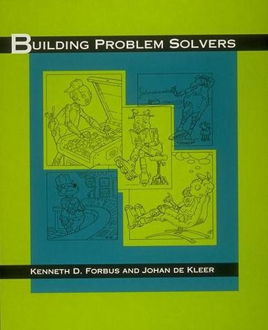

###### Song: ["God Wrote in Lisp"](http://www.prometheus-music.com/audio/eternalflame.mp3), [Lyrics](http://www.songworm.com/lyrics/songworm-parody/EternalFlame.html) by [Bob Kanefsky](http://www.songworm.com/songworm.html), sung by [Julia Ecklar](http://www.songworm.com/db/person/JuliaEcklar.html).

### History:

-  [Professor John McCarthy](http://jmc.stanford.edu/index.html) : [History of Lisp](http://jmc.stanford.edu/articles/lisp/lisp.pdf), 1979.
- [Simons Foundation Video interviews, July 26, 2005, John McCarthy](https://www.simonsfoundation.org/2013/03/13/john-mccarthy/)
-  [History of LISP](http://www.softwarepreservation.org/projects/LISP) Group by [Paul Mcjones](https://mcjones.org/dustydecks/) 
- [LISP I Programmers Manual - IBM 704 - 1960](https://lisp.com.br/archive/LISP_I_Programmers_Manual-IBM_704-1960.pdf) 
- [LISP 1.5 Programmer's Manual](http://www.softwarepreservation.org/projects/LISP/book/LISP%201.5%20Programmers%20Manual.pdf/view)
- [The Evolution of Lisp [PDF]](https://www.dreamsongs.com/Files/HOPL2-Uncut.pdf)  Guy L. Steele Jr. and [Richard P. Gabriel](https://www.dreamsongs.com/Bio.html)  , OOPSLA 2008 [Video](https://www.infoq.com/presentations/Lisp-Guy-Steele-Richard-Gabriel/).
- [Early LISP](https://funcall.blogspot.com/2021/03/early-lisp.html) , [Early LISP Part II (Apply redux)]( https://funcall.blogspot.com/2021/04/early-lisp-part-ii-apply-redux.html).
- [Technical Issues of Separation in Function Cells and Value Cells](https://dreamsongs.com/Separation.html) , [Lisp-1 vs Lisp-2](http://xahlee.info/emacs/emacs/lisp1_vs_lisp2.html)
- [Awesome Lisp Machine](https://github.com/ghosthamlet/awesome-lisp-machine)
- [A few things I know about LISP Machines](http://fare.tunes.org/LispM.html)
- [Awesome Lisp Companies](https://github.com/azzamsa/awesome-lisp-companies/)
- [HOPL IV: History of Programming Languages](https://www.pldi21.org/track_hopl.html) PLDI 2021 June.
- [Symbolics Lisp Machine Museum](http://smbx.org/)
- [Lisp Literature](https://web.archive.org/web/20211017064908/https://ambrevar.xyz/links/index.html) 
- Slava Akhmechet：[The Nature of Lisp](https://www.defmacro.org/ramblings/lisp.html) 2006 & Alec Jang 译 [Lisp的本质](https://www.cnblogs.com/Leap-abead/articles/762180.html)
- 赛义甫：[读《Lisp的本质》(The nature of Lisp)——悼Schönfinkel](http://blog.sciencenet.cn/blog-2349385-1039514.html)
- [The invention of λ-calculus](https://jepedersen.dk/pdf/2202lc.pdf).
- Paul Graham：The Roots of Lisp, 2001. 译 [Lisp之根源1](https://www.cnblogs.com/Leap-abead/articles/762226.html), [Lisp之根源2](https://shixiongfei.com/roots-of-lisp.html).
- [Lisp as the Maxwell’s equations of software](https://michaelnielsen.org/ddi/lisp-as-the-maxwells-equations-of-software/) , ["Maxwell's equations of software" examined](http://www.righto.com/2008/07/maxwells-equations-of-software-examined.html).
- Kazimir Majorinc: [A few examples of Lisp code typography](http://kazimirmajorinc.com/Documents/Lisp-code-typography/index.html)

****

### Scheme

 https://schemers.org/

[The Scheme Programming Language](https://www.staging.scheme.org/) 

[Awesome Scheme](https://github.com/schemedoc/awesome-scheme)

[Planet Scheme](https://planet.scheme.org/) collects blog posts from individuals and projects around the Scheme community.

[(chez (chez scheme))](https://www.scheme.com/)

[Practical Scheme](https://practical-scheme.net/)  

[Gauche](https://practical-scheme.net/gauche/) A Scheme Implementation

[CHICKEN Scheme](https://call-cc.org/) a practical and portable scheme system

[GNU Artanis](https://www.gnu.org/software/artanis/)  is a web application framework(WAF) written in Guile Scheme. [HardenedLinux / artanis](https://gitlab.com/hardenedlinux/artanis) 

[Akku.scm - Scheme package manager](https://akkuscm.org/)

**标准版本**：

- [R5RS](https://schemers.org/Documents/Standards/R5RS/), 中文翻译[算法语言 Scheme 修订5报告 [PDF]](https://www.math.pku.edu.cn/teachers/qiuzy/progtech/scheme/r5rscn.pdf).

- R6RS 现实中已被放弃：[R7RS versus R6RS](https://weinholt.se/articles/r7rs-vs-r6rs/), 中文翻译[R6RS 算法语言Scheme修订6报告](https://r6rs.mrliu.org/).

- [**R7RS** Scheme Progress Report](https://developers.slashdot.org/story/11/10/04/1942209/r7rs-scheme-progress-report), [ the **R7RS-small** standard for the Scheme programming language](https://small.r7rs.org/) & [**R7RS-large**](https://github.com/johnwcowan/r7rs-work/blob/master/R7RSHomePage.md) & [R7RS Index](https://r7rsindex.com/)

- Scheme Requests for Implementation https://srfi.schemers.org/

- [Scheme Reports](https://www.scheme-reports.org/)

- [Scheme and Functional Programming Workshop](http://www.schemeworkshop.org/) 研讨会

##### Video：

Learning SICP 公开课翻译项目 - https://learningsicp.github.io/ ; Eli Bendersky : [SICP](https://eli.thegreenplace.net/tag/sicp) 

Andy Balaam - Scheme Programming [bilibili](https://www.bilibili.com/video/av36910308/), [youtube](https://www.youtube.com/playlist?list=PLgyU3jNA6VjRMB-LXXR9ZWcU3-GCzJPm0); pdf[ Scheme Lisp - Feel the Cool](http://www.artificialworlds.net/presentations/scheme-accu2018/scheme-accu2018.pdf)

##### 学习资料：

- [Simply Scheme](https://people.eecs.berkeley.edu/~bh/ss-toc2.html): Introducing Computer Science

- [The Scheme Cookbook](https://cookbook.scheme.org/) 

- [The evolution of a Scheme programmer](https://erkin.party/blog/200715/evolution/) 

- [Yet Another Scheme Tutorial](http://www.shido.info/index_e.html) & 中文翻译[Scheme入门教程](https://deathking.github.io/yast-cn/)

- [Teach Yourself Scheme in Fixnum Days](https://ds26gte.github.io/tyscheme/index.html) & 中文翻译[Scheme语言简明教程](https://songjinghe.github.io/TYS-zh-translation/) 

<table>
<tr>
<th><a>The Little LISPer</a></th>
<th><a>The Little Schemer</a></th>
<th><a>The Scheme Programming Language</a></th>
<th><a>Lisp in Small Pieces</a></th>  
<th><a>Essentials of Programming Languages</a></th>
<th><a>Scheme and the Art of Programing</a></th>
<th><a>Logic Programming in Scheme</a></th>
</tr>
<tr>
<td></td>
<td></td>
<td><a href="https://www.scheme.com/tspl4">

</a></td>
<td><a>

</a></td>
<td><a>

</a></td>
<td><a>
</a></td>
<td><a>

</a></td>
</tr>
</table>

- 洪峰：[Scheme之道](https://blog.csdn.net/xiao_wanpeng/article/details/8466745)
- [SICP解题集](https://sicp.readthedocs.io/en/latest/) 
- [SICP Python 描述 中文版](https://wizardforcel.gitbooks.io/sicp-py/content/) 
- [Why *Structure and Interpretation of Computer Programs* Matters](http://www.cs.berkeley.edu/~bh/sicp.html) ; [译文：为何 SICP 意义重大](https://soulhacker.me/posts/why-sicp-matters/).
- 豆瓣 [计算机程序的构造和解释(原书第2版)](https://book.douban.com/subject/1148282/) 

****

### Common Lisp

 https://lisp-lang.org/

[Features of Common Lisp (2008)](http://random-state.net/features-of-common-lisp.html)

[A Critique of Common Lisp (1984)](https://www.dreamsongs.com/Files/clcrit.pdf) 

[Richard P. Gabriel](https://dreamsongs.com/)： [Common Lisp Object System](https://dreamsongs.com/CLOS.html).

[Kent M. Pitman](http://www.nhplace.com/kent/Papers/)： [Common Lisp: The Untold Story](http://www.nhplace.com/kent/Papers/cl-untold-story.html).

[CLiki](https://cliki.net/): the Common Lisp Wiki

[Common Lisp Language Overview](http://www.lispworks.com/products/lisp-overview.html) 

**学习路径**：

- 田春：[Common Lisp: An short introduction on most interesting parts](https://github.com/Lisp-Life/Lisp-China/blob/master/PDF/%E3%80%88Common%20Lisp%EF%BC%9AAn%20short%20introduction%20on%20most%20interesting%20parts%E3%80%89%20%EF%BC%88%E7%94%B0%E6%98%A5%E5%88%B6%EF%BC%892012%E5%B9%B410%E6%9C%88%20%E6%B5%99%E5%A4%A7%E8%AE%B2%E5%BA%A7PPT.pdf).
  - 浅谈Common Lisp的宏编程
  - 超凡脱俗的极限——Common Lisp
- [A Road to Common Lisp](http://stevelosh.com/blog/2018/08/a-road-to-common-lisp/) & [中文翻译版 Chinese simplified](https://keer2345.github.io/2019/03/10/lisp-A-Road-to-Common-Lisp/) 
- [An Introduction and Tutorial for Common Lisp](https://github.com/Lisp-Life/tutorial)
- [Pascal Costanza's Highly Opinionated Guide to Lisp](http://www.p-cos.net/lisp/guide.html) 2013
- [CS 325 AI Programming](https://courses.cs.northwestern.edu/325/readings/readings.php) Readings
- [How To Start a Common Lisp Project](https://irreal.org/blog/?p=8654) 2020
- [2022年Lisp入坑路线](https://zhuanlan.zhihu.com/p/462476123) 某位朋友的学习路线
- [How I got started with Common Lisp in 2017](https://anticrisis.github.io/2017/09/04/how-i-got-started-with-common-lisp-2017.html)

**播客**:

-  Lisp 程序员眼中的 Python https://pythonhunter.org/episodes/7  嘉宾：[David Gu](http://macdavid313.xyz/) ，2019年.

-  [Teahour.fm](https://teahour.fm/2014/03/17/interview-with-binghe.html)——https://www.ximalaya.com/sound/3031497 嘉宾：[田春](https://github.com/binghe) ,  2014年. [Gensym G2](https://ignitetech.com/softwarelibrary/gensym).

-  代码时间(终结) —— 嘉宾：韩祝鹏，Lisp入门. 2016年. https://www.ximalaya.com/keji/4867505/25888083

#### 书籍教程：https://lisp-lang.org/books/

- [Successful Lisp: How to Understand and Use Common Lisp](https://levselector.com/lisp_success.html)
  
  

   入门教程，文书浅显易懂，示例讲解到位，将Lisp的基本特性表述的很完整。

- Common Lisp: A Gentle Introduction to Symbolic Computation
  
  

   一本相当给力的 Lisp 入门书，以 Common Lisp 方言为表述载体。

- [中文翻译 Chinese simplified](https://acl.readthedocs.io/en/latest/zhCN/index.html) ; [ANSI Common Lisp 笔记](https://dirtysalt.github.io/html/ansi-common-lisp.html) ; ["ANSI Common LISP" Answer  for Practice](https://www.shido.info/lisp/pacl2_e.html)
  
  

   基本上覆盖了Common Lisp大部分的语言特性。适合初学者阅读，书后的附录很有参考价值。​

- Common Lisp Recipes: A Problem-Solution Approach
  
  

   进阶内容，不适合初学者，未讲述CL基础，且不谈及宏，偏向实践。

- [The Common Lisp Cookbook](https://lispcookbook.github.io/cl-cookbook/) & [中文翻译  Chinese simplified](https://oneforalone.github.io/cl-cookbook-cn)
  
  

  

- [中文翻译 Chinese simplified](https://sourceforge.net/projects/onlisp-cn/files/onlisp-cn_20140217.pdf/download)：Common LIsp 高级编程技术
  
  

   该书适合对Lisp有一定基础的同学，Lisp进阶的必读书籍，权威介绍宏。

- [Let Over Lambda](https://letoverlambda.com/) & [中文文档 Chinese simplified](https://oneforalone.github.io/lol-zh/index.html) ; [Let Over Lambda 笔记](https://abbypan.github.io/2013/12/13/lisp-let-over-lambda)
  
  

   书评https://www.douban.com/group/topic/101579766/ ； 在《On Lisp》的基础之上专门介绍macro的原理和使用。

- Programming Algorithms in Lisp
  
  

  

- The Common Lisp Condition System
  
  

  

- Object-Oriented Programming in Common Lisp: A Programmer's Guide to CLOS. [中文翻译](https://github.com/uternet/oop-in-cl)  覆盖CLOS所有关键必要内容，附有丰富的实际场景中的应用。
  
  
  
- Loving Common Lisp, or the Savvy Programmer's Secret Weapon 简短介绍了 Common Lisp一些基础知识，然后给出了一些实际例子，比如如何操作 MongoDB 等。这本书适合那些觉得 Common Lisp 学了找不到工作或者没什么实际用途，但又想简单了解下 Common Lisp 的人。
  
  
  
- [Lisp for the Web](http://www.adamtornhill.com/articles/lispweb.htm) ; [Lisp与现代Web开发](https://vitovan.com/lispweb3-cn.html)
  
  

   介绍 Common Lisp 开发 Web 应用

- [Common Lisp： the Language, 2nd Edition](https://www.cs.cmu.edu/Groups/AI/html/cltl/cltl2.html)
  
  

   简称CLtL2，是对ANSI标准委员会工作的二次阐释。并不是标准过程的一部分，但被很多Lisp厂商用来预测最终的委员会最终出的结果。 一些Lisp系统同时实现了CLtL2和ANSI标准的部分。

- Building Problem Solvers
  
  

   "古典人工智能"，严肃专著

- [《AI编程范例：Common Lisp实例研究》前言和书评](https://site.douban.com/145723/widget/notes/192921861/note/628959172/) 
  
  

   "古典人工智能"，流行读物

- [Practical Common Lisp笔记](https://jamsa.github.io/post/lisp/practical_common_lisp/) 
  
  

   本书第3章以及第23章至31章皆示例程序，可供练习，而第4章至22章可说是语言查询手册，此书不适合作为初级入门教科书。

- Common LISP craft. 书在展示`Lisp`独特的概念上是最有帮助的，比如闭包。 这本书很易读（不是说我现在精通了`Lisp`后说易读的那种），并包含了很多很明了的例子。附录中还有一个简要的`Common Lisp`手册。 推荐初学者也可以用这本书作为第一本书。

- Land of Lisp 全面了解CL技术及其强大特性的教程书，旧时的游戏实例瞥一眼即可。

- The Art of the Metaobject Protocol (AMOP) 这是元对象协议的权威说明。

- [Google Common Lisp Style Guide](https://google.github.io/styleguide/lispguide.xml) & [Google Common Lisp 风格指南](https://juanitofatas.github.io/Google-Common-Lisp-Style-Guide/GoogleCLSG-zhCN.xml) 

- Common Lisp Quick Reference

- [Simplified Common Lisp reference](https://jtra.cz/stuff/lisp/sclr/)

- [Common Lisp Syntax reference](https://jtra.cz/stuff/lisp/hypergrep/hypergrep.html)

- Garbage Collection: Algorithms for Automatic Dynamic Memory Management. 优秀手册涵盖了动态存储分配技术的各个方面。

- 《LISP语言》 [马希文教授纪念网站](http://www.math.pku.edu.cn/teachers/mxw/) 宋柔 编著，高等教育出版社，1990年7月第1版. 在改革开放伊始，马老师作为首批访问学者便抵达斯坦福大学AI实验室，与John McCarthy共事。这个时候的LISP标准化工作还未完成，这本书所依据的方言是DCLISP。全书共分十四章，一至三章介绍LISP的基本的语法、语义，S表达式的概念，以及LISP的核心部分LISP1；四至十章主要讨论LISP的函数程序设计部分；十四章介绍LISP中的一些高级成分和高级应用（实现模式传递参数机制，实现逻辑型语言和泛函型语言）。

- 《LISP语言》陈光喜，2005年09. 本书以Allegro Common Lisp 3.02为环境进行讲解，共分十二章，既包含CLOS又增添实践环节，适合入门学习。

- [Learn Lisp The Hard Way](https://github.com/thephoeron/LLTHW) source-code and full book text

- [Lisp Quickstart](https://cs.gmu.edu/~sean/lisp/LispTutorial.html) 

- [Starting a minimal Common Lisp project | notes.eatonphil.com](https://notes.eatonphil.com/starting-a-minimal-common-lisp-project.html) 

- [Debugging lisp](https://malisper.me/category/debugging-common-lisp/)

- [Depending in Common Lisp](https://stevelosh.com/blog/2022/08/depending-in-common-lisp/) 

- [Loops in Lisp](https://malisper.me/category/loops-in-lisp/)

- [Writing a Lisp](https://bernsteinbear.com/blog/lisp/) 

- [Why Lisp macros are cool, a Perl perspective](http://lists.warhead.org.uk/pipermail/iwe/2005-July/000130.html)

**News**:

- [Planet Lisp](http://planet.lisp.org/) is a meta blog that collects the contents of various Lisp-related blogs.
- [Planet SBCL](http://planet.sbcl.org/) s a meta blog that collects the contents of various SBCL-related blogs.
- [Quicklisp news](http://blog.quicklisp.org/)

#### CL生态：

[**Lisp journey**](https://lisp-journey.gitlab.io/):  [State of the Common Lisp ecosystem, 2020 🎉](https://lisp-journey.gitlab.io/blog/state-of-the-common-lisp-ecosystem-2020/) 

Debian  Synaptic Package Manager

[Awesome Common Lisp](https://awesome-cl.com/)

[Lisp ecosystem](https://wiki.huihoo.com/wiki/Lisp_ecosystem) - 开放百科 - 灰狐

[Discover Github trending Common Lisp open-source projects](https://www.libhunt.com/l/common-lisp)

- [Portacle](https://portacle.github.io/) - A Portable Common Lisp Development Environment.
- [Lispbox](https://common-lisp.net/project/lispbox/) is an IDE for Common Lisp development.
- [clasp](https://github.com/clasp-developers/clasp) Common Lisp environment
- [Corman Lisp](https://github.com/sharplispers/cormanlisp) is a Common Lisp development environment for Microsoft Windows operating systems 
- [Clozure Common Lisp](https://ccl.clozure.com/) is a free Common Lisp implementation
- [Allegro Common Lisp](https://franz.com/support/documentation/) 

> **Common Lisp + [Emacs](https://www.gnu.org/software/emacs/) + [SLIME](https://common-lisp.net/project/slime/) + [SBCL](http://sbcl.org/) + [Quicklisp](https://www.quicklisp.org/beta/) 最佳实践**

- **[Lem](https://github.com/lem-project/lem)** Common Lisp editor/IDE with high expansibility
- [LispWorks](http://www.lispworks.com/) Integrated cross-platform development tool for Common Lisp. [awesome lispworks](https://github.com/fourier/awesome-lispworks)
- [GNU's programming and extension language — GNU Guile](https://www.gnu.org/software/guile/) 编程实现
- [Quickdocs](https://quickdocs.org/) Find Common Lisp librariesshipped by Quicklisp 包管理
- [Lisp Project of the Day](https://github.com/40ants/lisp-project-of-the-day/)  

项目实例：[Learn Common Lisp by Example: Qt GUI with EQL5](https://blog.matthewdmiller.net/learn-common-lisp-by-example-qt-gui-with-eql5) 

[Ceramic](https://ceramic.github.io/) Bring the web to the desktop.

- [Answers from 2017 Common Lisp experts](https://blog.teknik.io/phoe/p/365)
- [Programming in the Common Lisp Ecosystem](https://tychoish.com/post/programming-in-the-common-lisp-ecosystem/)
- [Common Lisp programming: from novice to effective developer | Udemy](https://www.udemy.com/course/common-lisp-programming/) (付费)
- Grammarly Engineering Blog：[Running Lisp in Production](https://www.grammarly.com/blog/engineering/running-lisp-in-production/)
- [New York City Lisp User Group](http://www.lispnyc.org/learning-lisp) , [YouTube](https://www.youtube.com/channel/UCv33UlfX5S4PKxozGwUY_pA/videos)
- **[European Lisp Symposium](https://european-lisp-symposium.org)** , [YouTube](https://www.youtube.com/c/EuropeanLispSymposium/videos) 
- [Common Lisp in Practice](http://atomized.org/blog/2020/07/06/common-lisp-in-practice/)
- [Old McCarthy Had a Form](http://atomized.org/blog/2021/11/28/old-mccarthy-had-a-form/) 
- [Why Lisp is different](http://lispm.de/why-lisp-is-different) 
- [ForumRoguelike tutorial for Common Lisp](https://nwforrer.github.io/categories/roguelike-tutorial/)
- [CLiki: cl-launch](https://www.cliki.net/CL-Launch) is a [unix](https://www.cliki.net/unix) utility to make your Lisp software easily invokable from the shell command-line.
- [Build me a LISP](https://kirit.com/Build%20me%20a%20LISP)
- [Common Lisp Libraries](https://common-lisp-libraries.readthedocs.io/)
- [Common Lisp Libraries by Edi Weitz](https://edicl.github.io/)
- [ROS](https://wiki.ros.org/roslisp) 是一个构建机器人及应用的操作系统，主要目标是为机器人研究和开发提供代码复用的支持。
- [The Common Lisp Foundation](https://cl-foundation.org/)， [Common Lisp Libraries](https://common-lisp.net/libraries) 
- [LambdaNative](https://www.lambdanative.org/) is a cross-platform development environment written in Scheme, supporting Android, iOS, BlackBerry 10, OS X, Linux, Windows, OpenBSD, NetBSD, FreeBSD and OpenWrt.
- Armed Bear Common Lisp ([ABCL](https://abcl.org/)) is a full implementation of the Common Lisp language featuring both an interpreter and a compiler, running in the JVM. Originally started to be a scripting language for the J editor, it now supports JSR-223 (Java scripting API): it can be a scripting engine in any Java application. Additionally, it can be used to implement (parts of) the application using Java to Lisp integration APIs. [Reddit: ABCL Common Lisp vs Clojure](https://lisp-journey.gitlab.io/blog/reddit-abcl-common-lisp-vs-clojure/)
- An extensible, customizable, [free/libre](https://www.gnu.org/philosophy/free-sw.html) text editor — and more. At its core is an interpreter for Emacs Lisp, a dialect of the Lisp programming language with extensions to support text editing.
- [Sly：Sylvester the Cat's Common Lisp IDE](https://joaotavora.github.io/sly/)
- [Roswell](https://github.com/roswell/roswell): intended to be a launcher for a major lisp environment that just works.
- [clog](https://github.com/rabbibotton/clog) \- The Common Lisp Omnificent GUI
- [restas](https://github.com/archimag/restas) Common Lisp  web framework
- [cl-ppcre](https://github.com/edicl/cl-ppcre) Common Lisp regular expression library
- [Embeddable Common-Lisp](https://ecl.common-lisp.dev/) is an interpreter of the Common-Lisp language as described in the X3J13 Ansi specification, featuring CLOS (Common-Lisp Object System), conditions, loops, etc, plus a translator to C, which can produce standalone executables.
- [LISP In Summer Projects](http://www.lispinsummerprojects.org/) 

****

### Racket

 https://www.racket-lang.org/

 tyrchen 陈天：[Racket语言入门](https://tyrchen.github.io/racket-book/)

- [Racket News](https://racket-news.com/)

- [Racket Stories](https://racket-stories.com/)

- [NU PLT](https://www2.ccs.neu.edu/racket/)，[SICP Support for DrRacket](https://www.neilvandyke.org/racket/sicp/)，[PLT Scheme is now Racket](https://plt-scheme.org/)

[An Overview of Common Racket Data Structures](https://alex-hhh.github.io/2019/02/racket-data-structures.html)

[Why learn Racket? A student's perspective - Micah Cantor](https://www.micahcantor.com/blog/why-learn-racket/) 

[Parsing propositional logic in 33 lines of Racket](https://micahcantor.xyz/blog/logic-racket-parser) 

****

### Clojure

 https://clojure.org/

[A history of Clojure](https://download.clojure.org/papers/clojure-hopl-iv-final.pdf)  Rich Hickey  ,  2020. 

[Clojure from a Schemer's perspective](https://www.more-magic.net/posts/thoughts-on-clojure.html) 

[Planet Clojure](http://planet.clojure.in/) is a meta blog that collects posts from the blogs of various Clojure hackers and contributors.

[The Clojure Philosophy](http://www.drdobbs.com/architecture-and-design/the-clojure-philosophy/240150710/)

[Community-Powered Clojure Documentation and Examples | ClojureDocs](https://clojuredocs.org/)

Elango Cheran：[Why Clojure (Lisp) is good for writing transpilers](https://elangocheran.com/2020/03/18/why-clojure-lisp-is-good-for-writing-transpilers/) 

Robert C. Martin (Uncle Bob)：[Why Clojure?](http://blog.cleancoder.com/uncle-bob/2019/08/22/WhyClojure.html)

刘家财: [国内第一套 Clojure 视频课程](https://github.com/jiacai2050/learn_clojure.mp4)(付费)，Let Lisp Rocks !

播客： 代码时间(终结) —— 嘉宾：何婧誉（Loretta），Clojure编程. 2016年. https://www.ximalaya.com/keji/4867505/19342829

****

### miniKanren

[**minikanren**.org](http://minikanren.org/)

   The Reasoned Schemer

In this UnConf talk, Dan Friedman and William Byrd demonstrate the miniKanren logic programming system for Scheme. [bilibili](https://www.bilibili.com/video/BV1NW411f76M)

****

### Emacs Lisp

[Evolution of Emacs Lisp](https://dl.acm.org/doi/10.1145/3386324) Stefan Monnier, Michael Sperber. Proceedings of the ACM on Programming LanguagesJune 2020 Article No 74. 

****

### Emacs 编辑器

[EmacsConf](https://emacsconf.org)

* [22 years of Emacs](https://arjenwiersma.nl/writeups/emacs/22-years-of-emacs/)  
* [Emacs China 社区](https://emacs-china.org/)
* [EmacsTalk](https://emacstalk.github.io/) 一档专注在 Emacs 社区的程序员闲聊节目
* [Emacs News](https://sachachua.com/blog/) 📰 Sacha Chua
* [Using Emacs Series](https://cestlaz.github.io/stories/emacs/) 📅 Mike Zamansky
* [Emacs Handbook](https://eiuapp.github.io/emacs-handbook/) 📚
* [Emacs Video](https://www.youtube.com/c/ProtesilaosStavrou/videos) 📺 Protesilaos Stavrou
* [Emacs org-mode examples and cookbook](http://ehneilsen.net/notebook/orgExamples/org-examples.html) 
* [如何提高编程速度](https://www.zhihu.com/column/c_1116711987706478592) 📝 [陈斌](http://blog.binchen.org/) [github](https://github.com/redguardtoo)
* [Xah Emacs](http://xahlee.info/emacs/index.html)
* [More Productive with Emacs](https://lucidmanager.org/tags/emacs/)
* [Emacs Docs](https://www.emacsdocs.org/)
* [MELPA](https://melpa.org/#/)

学习:

Emacs 高手修炼手册 [bilibili](https://www.bilibili.com/video/BV13g4y167Zn/) , https://www.zhihu.com/column/c_1413568526368542721

Emacs 轻奢之路 [bilibili](https://www.bilibili.com/video/BV1T64y1R7EL) , https://zhuanlan.zhihu.com/p/496645254

21天学会Emacs 2022 Edition [bilibili](https://space.bilibili.com/292659700/video) , https://book.emacs-china.org/

EmacsTalk 2022 春节特别节目 Lighting Talks [bilibili](https://www.bilibili.com/video/BV1Mr4y1a7JT) 

****

### Podcasts：

*  Software Engineering Radio——http://www.se-radio.net/2006/11/episode-36-interview-guy-steele/ 嘉宾：Guy Steele
*  Software Engineering Radio——https://www.se-radio.net/2008/01/episode-84-dick-gabriel-on-lisp/ 嘉宾: Richard P. Gabriel
*  Software Engineering Radio——https://www.se-radio.net/2010/03/episode-158-rich-hickey-on-clojure/ 嘉宾: Rich Hickey
*  [Functional Geekery](https://www.functionalgeekery.com/)—— A podcast on Functional Programming, covering topics across multiple languages.
* CoRecursive Podcast： [The Little Typer](https://corecursive.com/023-little-typer-and-pie-language/) with Dan Friedman and David Christiansen
* CoRecursive Podcast： [God's Programming Language](https://corecursive.com/021-gods-programming-language-with-philip-wadler/) with Philip Wadler
* CoRecursive Podcast： [Language Oriented Design](https://corecursive.com/039-hal-abelson-sicp/) discussing SICP with Hal Abelson
* CoRecursive Podcast： [LISP in Space With Ron Garret](https://corecursive.com/lisp-in-space-with-ron-garret/) 

### Video：

* Guy Steele - Cool Ideas (Dan Friedman's 60th Birthday) [bilibili](https://www.bilibili.com/video/av32496013/) [youtube](https://www.youtube.com/watch?v=IHP7P_HlcBk)
* Little Bits of Lisp [bilibili](https://www.bilibili.com/video/BV15J411J7Aw) [youtube](https://www.youtube.com/playlist?list=PL2VAYZE_4wRJi_vgpjsH75kMhN4KsuzR_) & Pushing Pixels With Lisp [bilibili](https://www.bilibili.com/video/BV1K7411v7bj) [youtube](https://www.youtube.com/playlist?list=PL2VAYZE_4wRITJBv6saaKouj4sWSG1FcS) 
* [Readable Lisp S-expressions Project](https://readable.sourceforge.io/)

### 高校：

|                           Edu                           |                            Course                            |                                                              |
| :-----------------------------------------------------: | :----------------------------------------------------------: | :----------------------------------------------------------: |
| University at Buffalo, The State University of New York | [A Short Course in Common Lisp](https://cse.buffalo.edu/~shapiro/Courses/CSE202/Summer2004/) Summer, 2004 |                                                              |
|                         Indiana                         | [C311/B521/A596 Programming Languages](https://cgi.soic.indiana.edu/~c311/doku.php) |  [Daniel P. Friedman](https://legacy.cs.indiana.edu/~dfried/) [Daniel P Friedman: A Celebration 2004](https://legacy.cs.indiana.edu/dfried_celebration.html) |
|    Queens College of the City University of New York    | [CSCI 316 Principles of Programming Languages](https://phantom.cs.qc.cuny.edu/kong/316/) |                        Tat Yung Kong                         |
|                           MIT                           | [Dynamic Languages Group](http://www.ai.mit.edu/projects/dynlangs/) |                                                              |
|                 Simon Fraser University                 | CMPT 310: [Artificial Intelligence Survey](https://www2.cs.sfu.ca/CourseCentral/310/pwfong/) |                                                              |
|                                                         | [CS3723 Programming Languages Spring 2011](http://www.cs.uccs.edu/~qyi/UTSA-classes/cs3723/) |                                                              |
|                         Cornell                         |          http://www.cs.cornell.edu/~kozen/#Courses           |  Dexter Kozen |
|                         MPI-SWS                         | Programming Languages, Etc. [Reading Group](https://people.mpi-sws.org/~skilpat/plerg/) (PLERG) |  Scott Kilpatrick |
|                        北京大学                         | [程序设计技术和方法 (教科书SICP)](http://www.math.pku.edu.cn/teachers/qiuzy/progtech/) |  2014春季本科生 [裘宗燕](https://www.math.pku.edu.cn/teachers/qiuzy/) 退休 |
|                        北京大学                         | [程序设计语言原理]((http://www.math.pku.edu.cn/teachers/qiuzy/plan/)) (主要参考书:《程序设计语言——实践之路》[文献汇编](http://www.math.pku.edu.cn/teachers/qiuzy/plan/lits/index.htm) |  2012 研究生 [裘宗燕](https://www.math.pku.edu.cn/teachers/qiuzy/) 退休 |
|                        南京大学                         |      Structure and Interpretation of Computer Programs       |  [冯新宇](https://cs.nju.edu.cn/xyfeng/) |
|                        南京大学                         | 程序设计语言的形式语义 (Formal Semantics of Programming Languages） |  [梁红瑾](https://cs.nju.edu.cn/hongjin/) |
|                      uwaterloo.ca                       |                    Teach Yourself Racket                     |       https://cs.uwaterloo.ca/~plragde/flaneries/TYR/        |
|                         edx.org                         | [How to Code: Simple Data](https://www.edx.org/course/how-to-code-simple-data) |  [Gregor Kiczales](https://www.cs.ubc.ca/people/gregor-kiczales) |
|                       Nottingham                        | Functional Programming in Haskell [bilibili](https://www.bilibili.com/video/BV1ti4y1P7TF) |      [Graham Hutton](http://www.cs.nott.ac.uk/~pszgmh/)      |
|                          Brown                          | [Programming and Programming Languages](https://papl.cs.brown.edu/2020/) |                  Shriram Krishnamurthi ...                   |
|                         Harvard                         | [History of Programming Languages](https://groups.seas.harvard.edu/courses/cs252/2016fa/) |                      Christos Dimoulas                       |
|                        Syracuse                         | [Programming Languages: Theory and Practice](http://www.cis.syr.edu/courses/cis352/) |                                                              |
|               Vancouver Island University               |               CSCI 330: Programming Languages                | [Common lisp by examples](http://csci.viu.ca/~wesselsd/courses/csci330/code/lisp/index.html) ; [Common Lisp By Example](https://github.com/gypsydave5/common-lisp-by-example) |
|                 George Mason University                 |        [Lisp at GMU](https://cs.gmu.edu/~sean/lisp/)         |                                                              |

### Journal：

* [Lisp and Symbolic Computation / Higher-Order and Symbolic Computation](https://dblp.org/db/journals/lisp/index.html)

### 博文：

* Peter Norvig:  [A Retrospective on Paradigms of AI Programming](https://norvig.com/Lisp-retro.html)
* Peter Norvig:  [Python for Lisp Programmers](https://norvig.com/python-lisp.html)
* Peter Norvig:  [(How to Write a (Lisp) Interpreter (in Python))](https://norvig.com/lispy.html)
* Eric Normand:  [Lisp with Macros is Two Languages](https://ericnormand.me/article/lisp-with-macros-language-stack)
* [History of Lisp](http://lambda-the-ultimate.org/node/5548) | Lambda the Ultimate
* [Research in Programming Languages](http://lambda-the-ultimate.org/node/4469) | Lambda the Ultimate
* Gordon S. Novak Jr. [Scheme vs. Common Lisp](http://www.cs.utexas.edu/~novak/schemevscl.html) 
* [Gordon S. Novak Jr.](https://www.cs.utexas.edu/~novak/) [CS 394P: Lisp Notes](https://www.cs.utexas.edu/users/novak/cs394plisp.html)
* Gordon S. Novak Jr. [Lisp Style and Efficiency](https://www.cs.utexas.edu/users/novak/lispeff.html)
* [Differences between Scheme and Common Lisp](https://dept-info.labri.fr/~strandh/Teaching/Langages-Enchasses/Common/Strandh-Tutorial/diff-scheme.html)
* [An Intuition for Lisp Syntax](https://stopa.io/post/265)
* [The memory models that underlie programming languages](http://canonical.org/~kragen/memory-models/) & [编程语言中的 6 种内存模型（2016）](https://arthurchiao.art/blog/memory-models-underlie-programming-languages-zh/)
* [Can Lisp Macro Change Lisp Syntax?](http://xahlee.info/comp/lisp_syntax_macro_reader.html)
* [How Lisp Became God's Own Programming Language](https://twobithistory.org/2018/10/14/lisp.html)
* [Lisp的永恒之道](https://www.cnblogs.com/weidagang2046/archive/2012/06/03/tao_of_lisp.html)
* [不用 Lisp 学 Lisp](https://techsingular.net/2015/03/22/)
* Why I love Lisp: https://pupeno.com/2011/08/16/why-i-love-lisp/ 
* Why Lisp Failed: http://locklessinc.com/articles/why_lisp_failed/
* This Old Lisp: http://thisoldlisp.com/talks/els-2018/ R. Matthew Emerson ( keynote talk from the 2018 European Lisp Symposium in Marbella, Spain)
* The Lisp Curse: http://www.winestockwebdesign.com/Essays/Lisp_Curse.html
* [Nils M Holm's Ephemeralia](https://t3x.org/)
  * [LISP FROM NOTHING](http://t3x.org/lfn/)
  * [Lisp in Small Parts](http://lisp.plasticki.com/) Zach Beane
- **[The Rise of Worse is Better](http://dreamsongs.com/RiseOfWorseIsBetter.html)** - Richard P. Gabriel

- [The Art of Lisp & Writing](https://dreamsongs.com/ArtOfLisp.html)

- [Build Your Own Lisp](https://builyouownlisp.com/) & [中文版 Chinese simplified](https://ksco.gitbooks.io/build-your-own-lisp/) 

****

附：

- The Little MLer
  
  

  

- The Little Java, A Few Petterns
  
  

  

- The Little Prover
  
  

   实现 J-Bob证明器

- The Little Typer
  
  

   A little taste of Dependent Types
