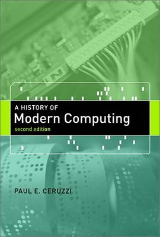

#### Song: ["God Wrote in Lisp"](http://www.prometheus-music.com/audio/eternalflame.mp3), [Lyrics](http://www.songworm.com/lyrics/songworm-parody/EternalFlame.html) by [Bob Kanefsky](http://www.songworm.com/songworm.html), sung by [Julia Ecklar](http://www.songworm.com/db/person/JuliaEcklar.html).

### History:

-  [Professor John McCarthy](http://jmc.stanford.edu/index.html) 
- [History of LISP](http://www.softwarepreservation.org/projects/LISP) editor [Paul Mcjones](https://mcjones.org/dustydecks/) 
- [LISP I Programmers Manual - IBM 704 - 1960](https://lisp.com.br/archive/LISP_I_Programmers_Manual-IBM_704-1960.pdf)
- Welcome to [schemers.org](https://schemers.org/)!  [Awesome Scheme](https://github.com/schemedoc/awesome-scheme)
- [(chez (chez scheme))](https://www.scheme.com/)
- [Common Lisp](https://lisp-lang.org/) & [Awesome Common Lisp](https://github.com/CodyReichert/awesome-cl)
- [Clojure](https://clojure.org/) 
- [Racket](https://racket-lang.org/) ，[NU PLT](https://www2.ccs.neu.edu/racket/)，[SICP Support for DrRacket](https://www.neilvandyke.org/racket/sicp/https://www.neilvandyke.org/racket/sicp/)，[PLT Scheme is now Racket](https://plt-scheme.org/)
- [A Critique of Common Lisp (1984)](https://www.dreamsongs.com/Files/clcrit.pdf) 
- [The Evolution of Lisp [PDF]](https://www.dreamsongs.com/Files/HOPL2-Uncut.pdf)  Guy L. Steele Jr. and [Richard P. Gabriel](https://www.dreamsongs.com/Bio.html)  , OOPSLA 2008 [Video](https://www.infoq.com/presentations/Lisp-Guy-Steele-Richard-Gabriel/).
- [Features of Common Lisp (2008)](http://random-state.net/features-of-common-lisp.html)
- [A history of Clojure](https://download.clojure.org/papers/clojure-hopl-iv-final.pdf)  Rich Hickey  ,  2020. 
- [Evolution of Emacs Lisp](https://dl.acm.org/doi/10.1145/3386324) Stefan Monnier, Michael Sperber. Proceedings of the ACM on Programming LanguagesJune 2020 Article No 74. 
- [Lisp-1 vs Lisp-2](http://xahlee.info/emacs/emacs/lisp1_vs_lisp2.html)
- [Awesome Lisp Machine](https://github.com/ghosthamlet/awesome-lisp-machine)
- [Awesome Lisp Companies](https://github.com/azzamsa/awesome-lisp-companies/)
- [HOPL IV: History of Programming Languages](https://www.pldi21.org/track_hopl.html) PLDI 2021 June.
- [Symbolics Lisp Machine Museum](http://smbx.org/)

### 学习路径:

-  [A Road to Common Lisp](http://stevelosh.com/blog/2018/08/a-road-to-common-lisp/) - Steve Losh & [中文翻译版](https://keer2345.github.io/2019/03/10/lisp-A-Road-to-Common-Lisp/)

### 生态：

- [State of the Common Lisp ecosystem, 2020 🎉](https://lisp-journey.gitlab.io/blog/state-of-the-common-lisp-ecosystem-2020/)  [vindarel](https://github.com/vindarel)

- [State of Common Lisp Web Development - an overview](https://lisp-journey.gitlab.io/web-dev/) 2017  [vindarel](https://github.com/vindarel)

- [Python VS Common Lisp, workflow and ecosystem](https://lisp-journey.gitlab.io/pythonvslisp/) 2019  [vindarel](https://github.com/vindarel)

- [The Common Lisp Cookbook](https://lispcookbook.github.io/cl-cookbook/) & [中文翻译](https://oneforalone.github.io/cl-cookbook-cn/) 

- [Let Over Lambda - 50 Years of Lisp](https://letoverlambda.com/) & [中文文档](https://oneforalone.github.io/lol-zh/index.html) 

- [s-exp syntax](https://www.cliki.net/S-exp%20syntax) 

- [Lisp Project of the Day](https://40ants.com/lisp-project-of-the-day/)

- [The Common Lisp Foundation](https://cl-foundation.org/)， [Common Lisp Libraries](https://common-lisp.net/libraries)

- [Planet Lisp](http://planet.lisp.org/) is a meta blog that collects the contents of various Lisp-related blogs.

- [Planet Scheme](https://planet.scheme.org/) collects blog posts from individuals and projects around the Scheme community.

- [Planet SBCL](http://planet.sbcl.org/) s a meta blog that collects the contents of various SBCL-related blogs.

- [Planet Clojure](http://planet.clojure.in/) is a meta blog that collects posts from the blogs of various Clojure hackers and contributors.

- [Quicklisp news](http://blog.quicklisp.org/)

- [Racket News](https://racket-news.com/)

- [Racket Stories](https://racket-stories.com/)

- [Portacle](https://portacle.github.io/) - A Portable Common Lisp Development Environment.

- [Lispbox](https://common-lisp.net/project/lispbox/) is an IDE for Common Lisp development.

- [clasp](https://github.com/clasp-developers/clasp) Common Lisp environment

- [Clozure Common Lisp](https://ccl.clozure.com/) is a free Common Lisp implementation

- [LispWorks](http://www.lispworks.com/) Integrated cross-platform development tool for Common Lisp. [awesome lispworks](https://github.com/fourier/awesome-lispworks)

- Steel Bank Common Lisp ([SBCL](http://sbcl.org/)) is a high performance Common Lisp compiler. 

- Armed Bear Common Lisp ([ABCL](https://abcl.org/)) is a full implementation of the Common Lisp language featuring both an interpreter and a compiler, running in the JVM. Originally started to be a scripting language for the J editor, it now supports JSR-223 (Java scripting API): it can be a scripting engine in any Java application. Additionally, it can be used to implement (parts of) the application using Java to Lisp integration APIs. [Reddit: ABCL Common Lisp vs Clojure](https://lisp-journey.gitlab.io/blog/reddit-abcl-common-lisp-vs-clojure/)

- [GNU Emacs](https://www.gnu.org/software/emacs/) An extensible, customizable, [free/libre](https://www.gnu.org/philosophy/free-sw.html) text editor — and more. At its core is an interpreter for Emacs Lisp, a dialect of the Lisp programming language with extensions to support text editing.

- [Lisp Style and Efficiency](https://www.cs.utexas.edu/users/novak/lispeff.html)

- [SLIME](https://common-lisp.net/project/slime/): The Superior Lisp Interaction Mode for Emacs.

- [roswell](https://github.com/roswell/roswell): intended to be a launcher for a major lisp environment that just works.

- [clog](https://github.com/rabbibotton/clog) \- The Common Lisp Omnificent GUI

- [restas](https://github.com/archimag/restas) Common Lisp  web framework

- [Quicklisp](https://www.quicklisp.org/beta/)  is a library manager for Common Lisp. [Quickdocs](https://quickdocs.org/) Find Common Lisp librariesshipped by Quicklisp

- [GNU's programming and extension language — GNU Guile](https://www.gnu.org/software/guile/)

  > Guile is designed to help programmers create flexible applications that can be extended by users or other programmers with plug-ins, modules, or scripts.
  >
  > With Guile you can create applications and games for the [desktop](https://www.gnu.org/software/guile/#apps-using-guile), the [Web](https://www.gnu.org/software/guile/#apps-using-guile), the [command-line](https://www.gnu.org/software/guile/#apps-using-guile), and more.

- [GNU Artanis](https://www.gnu.org/software/artanis/)  is a web application framework(WAF) written in Guile Scheme. [HardenedLinux / artanis](https://gitlab.com/hardenedlinux/artanis) 

- [Allegro CL](https://franz.com/support/documentation/) 

- [Starting a minimal Common Lisp project | notes.eatonphil.com](https://notes.eatonphil.com/starting-a-minimal-common-lisp-project.html)

### 著述:

- 《LISP语言》马希文  ( [马希文教授纪念网站](http://www.math.pku.edu.cn/teachers/mxw/) ) 宋柔 编著，高等教育出版社，1990年7月第1版. 在改革开放伊始，马老师作为首批访问学者便抵达斯坦福大学AI实验室，与John McCarthy共事。这个时候的LISP标准化工作还未完成，这本书所依据的方言是DCLISP。全书共分十四章，一至三章介绍LISP的基本的语法、语义，S表达式的概念，以及LISP的核心部分LISP1；四至十章主要讨论LISP的函数程序设计部分；十四章介绍LISP中的一些高级成分和高级应用（实现模式传递参数机制，实现逻辑型语言和泛函型语言）。
- 《LISP语言》陈光喜，2005年. 本书以Allegro Common Lisp 3.02为环境进行讲解，共分十二章，既包含CLOS又增添实践环节，适合入门学习。
- [Nils M Holm's Ephemeralia](https://t3x.org/)
- [算法语言 Scheme 修订5报告 [PDF]](https://www.math.pku.edu.cn/teachers/qiuzy/progtech/scheme/r5rscn.pdf) 王咏刚
- [R7RS Scheme Progress Report](https://developers.slashdot.org/story/11/10/04/1942209/r7rs-scheme-progress-report) 2011. [ the R7RS-small standard for the Scheme programming language](https://small.r7rs.org/)
- [Scheme and Functional Programming Workshop](http://www.schemeworkshop.org/)
- [LISP FROM NOTHING](http://t3x.org/lfn/)
- [Lisp Quickstart](https://cs.gmu.edu/~sean/lisp/LispTutorial.html)
- 《[ANSI Common Lisp Standard Specification Draft 1994 (EN)](https://lisp.com.br/archive/ansi_cl_standard_draft_nice.pdf)》[中文翻譯版](https://acl.readthedocs.io/en/latest/)
- 《[Scheme 入门教程](https://deathking.github.io/yast-cn/)》
- 《[Teach Yourself Scheme in Fixnum Days](https://ds26gte.github.io/tyscheme/index.html)》[中文翻译](https://songjinghe.github.io/TYS-zh-translation/) 

### Books:

<table>
<tr>
    <th><a>The Little LISPer</a></th>
    <th><a>The Little Schemer</a></th>
    <th><a>The Little MLer</a></th>
    <th><a>The Little Java, A Few Petterns</a></th>
    <th><a>The Little Prover</a></th>
    <th><a>The Little Typer</a></th>
</tr>
<tr>
    <td></td>
    <td></td>
    <td></td>
    <td><a>

</a></td>
    <td></td>
    <td></td>
</tr>
<tr>
<th><a>Common Lisp Recipes：A Problem-Solution Approach</a></th> 
<th><a>Common Lisp the Language, 2nd Edition 图片链接</a></th>
<th><a>Common Lisp: A Gentle Introduction to Symbolic Computation 图片链接</a></th>
<th><a>ANSI Common Lisp</a></th>
<th><a>Practical Common Lisp 图片链接</a></th>
<th><a>Let Over Lambda 图片链接</a></th>
</tr>
<tr>
<td><a href="">

</a>
<td><a href="https://www.cs.cmu.edu/afs/cs.cmu.edu/project/ai-repository/ai/html/cltl/cltl2.html">

</a></td>
<td><a href="http://www.cs.cmu.edu/~dst/LispBook/">

</a></td>
<td><a>

</a></td>
<td><a href="http://www.gigamonkeys.com/book/">

</a></td>
<td><a href="https://letoverlambda.com/">

</a></td>
</tr>
<tr>
<th><a>实用Common Lisp编程</a></th>
<th><a>The Common Lisp Cookbook 图片链接</a></th>
<th><a>The Common Lisp Condition System</a></th> 
<th><a>The Scheme Programming Language, 4th Edition 图片链接</a></th>
<th><a>Essentials of Programming Languages</a></th>
<th><a>Scheme and the Art of Programing</a></th>
</tr>
<tr>
<td><a>

</a></td>
<td><a href="https://lispcookbook.github.io/cl-cookbook/">

</a></td>
<td><a href="">

</a></td>
<td><a href="https://www.scheme.com/tspl4">

</a></td>
<td><a>

</a></td>
<td><a>
</a></td>
</tr>
<th><a>Programming Languages: Application and Interpretation 图片链接</a></th>
<th><a>Successful Lisp:How to Understand and Use Common lisp</a></th>
<th><a>Logic Programming in Scheme</a></th>
<th><a>Paradigms of Artificial Intelligence Programming: Case Studies in Common Lisp 图片链接</a>
</th>
<th><a>On Lisp: Advanced Techniques for Common Lisp 图片链接</a></th>
<th><a>Lisp in Small Pieces</a></th>    
<tr>
<td><a href="https://papl.cs.brown.edu/">

</a></td>
<td><a>

</a>
</td>
<td><a>

</a></td>
<td><a href="https://github.com/norvig/paip-lisp">

</a></td>
<td><a href="http://paulgraham.com/onlisptext.html">

</a></td>
<td><a>

</a></td>
</tr>
<tr>
</tr>
</table>

《On Lisp: Advanced Techniques for Common Lisp》 Paul Graham   [中文翻译](https://sourceforge.net/projects/onlisp-cn/files/onlisp-cn_20140217.pdf/download) ( Common LIsp 高级编程技术 )

**Object-Oriented Programming in Common LISP: A Programmer's Guide to CLOS** Sonja E. Keene 1989.

**ANSI Common Lisp** Paul Graham [中文翻译](https://acl.readthedocs.io/en/latest/zhCN/index.html) 

**Learning to Program in LISP** John R.Anderson, Robert Farrell and Ron Sauers. Carnegie-Mellon University. Cognitive Science 8,87-129(1984).

**The Roots of Lisp** Paul Graham. Draft,January 18, 2002.

**Basic Lisp Techniques** David J.Cooper, franz.com, 2003.

**An Axiomatic Basis for Computer Programming** C.A.R.Hoare.

**Computability and Complexity-from a programming perspective** Neils D.Jones, the MIT Press, 1997. this book is not directly related to LISP,needless to say that it is Saitama.

The Original '**Lambda Papers**' by Guy Steele and Gerald Sussman : http://library.readscheme.org/page1.html

**[The Rise of Worse is Better](http://dreamsongs.com/RiseOfWorseIsBetter.html)** - Richard P. Gabriel

[The Art of Lisp & Writing](https://dreamsongs.com/ArtOfLisp.html) - Richard P. Gabriel

[Build Your Own Lisp](https://builyouownlisp.com/) & [中文版](https://ksco.gitbooks.io/build-your-own-lisp/) 

### Emacs:

  * [Emacs China 社区](https://emacs-china.org/)
  * [EmacsTalk](https://emacstalk.github.io/) 一档专注在 Emacs 社区的程序员闲聊节目
  * [Emacs News](https://sachachua.com/blog/) 📰 Sacha Chua
  * [Using Emacs Series](https://cestlaz.github.io/stories/emacs/) 📅 Mike Zamansky
  * [Emacs Handbook](https://eiuapp.github.io/emacs-handbook/) 📚
  * [Emacs Video](https://www.youtube.com/c/ProtesilaosStavrou/videos) 📺 Protesilaos Stavrou
  * [如何提高编程速度](https://www.zhihu.com/column/c_1116711987706478592) 📝 [陈斌](http://blog.binchen.org/) [github](https://github.com/redguardtoo)
  * [Xah Emacs](http://xahlee.info/emacs/index.html)
  * [More Productive with Emacs](https://lucidmanager.org/tags/emacs/)
  * [Emacs Docs](https://www.emacsdocs.org/)
  * [MELPA](https://melpa.org/)

### Forum:

  * [Lisp journey](https://lisp-journey.gitlab.io/)  [vindarel](https://github.com/vindarel)
  * [New York City Lisp User Group](http://www.lispnyc.org/learning-lisp)：learning lisp [YouTube](https://www.youtube.com/channel/UCv33UlfX5S4PKxozGwUY_pA/videos)
  * [EmacsConf](https://emacsconf.org)
  * [European Lisp Symposium](https://european-lisp-symposium.org) , [YouTube](https://www.youtube.com/c/EuropeanLispSymposium/videos)
  * [Emacs China](https://emacs-china.org/)
  * [Scheme中文社区](http://theschemer.org/)
  * [Clojure China](http://www.clojurechina.com/zh-cn/)

### Podcasts:

  *  Lisp 程序员眼中的 Python https://pythonhunter.org/episodes/7  嘉宾：[David Gu](http://macdavid313.xyz/) ，2019年.

  *  [Teahour.fm](https://teahour.fm/2014/03/17/interview-with-binghe.html)——https://www.ximalaya.com/sound/3031497 嘉宾：[田春](https://github.com/binghe) ,  2014年.

  *  代码时间(终结) —— 嘉宾：韩祝鹏，Lisp入门. 2016年. https://www.ximalaya.com/keji/4867505/25888083

  *  代码时间(终结) —— 嘉宾：何婧誉（Loretta），Clojure编程. 2016年. https://www.ximalaya.com/keji/4867505/19342829

  *  Software Engineering Radio——http://www.se-radio.net/2006/11/episode-36-interview-guy-steele/ 嘉宾：Guy Steele

  *  Software Engineering Radio——https://www.se-radio.net/2008/01/episode-84-dick-gabriel-on-lisp/ 嘉宾: Richard P. Gabriel

  *  Software Engineering Radio——https://www.se-radio.net/2010/03/episode-158-rich-hickey-on-clojure/ 嘉宾: Rich Hickey

  *  [Functional Geekery](https://www.functionalgeekery.com/)—— A podcast on Functional Programming, covering topics across multiple languages.

### Video:

  * Simons Foundation Video interviews, July 26, 2005, John McCarthy - https://www.simonsfoundation.org/2013/03/13/john-mccarthy/
  * Learning SICP 公开课翻译项目 - https://learningsicp.github.io/
  * Andy Balaam - Scheme Programming [bilibili](https://www.bilibili.com/video/av36910308/) [youtube](https://www.youtube.com/playlist?list=PLgyU3jNA6VjRMB-LXXR9ZWcU3-GCzJPm0)
  * Guy Steele - Cool Ideas (Dan Friedman's 60th Birthday) [bilibili](https://www.bilibili.com/video/av32496013/) [youtube](https://www.youtube.com/watch?v=IHP7P_HlcBk)
  * Little Bits of Lisp [bilibili](https://www.bilibili.com/video/BV15J411J7Aw) [youtube](https://www.youtube.com/playlist?list=PL2VAYZE_4wRJi_vgpjsH75kMhN4KsuzR_) & Pushing Pixels With Lisp [bilibili](https://www.bilibili.com/video/BV1K7411v7bj) [youtube](https://www.youtube.com/playlist?list=PL2VAYZE_4wRITJBv6saaKouj4sWSG1FcS) 
  * [Common Lisp programming: from novice to effective developer | Udemy](https://www.udemy.com/course/common-lisp-programming/) (付费)
  * 刘家财: [国内第一套 Clojure 视频课程](https://github.com/jiacai2050/learn_clojure.mp4)(付费)，Let Lisp Rocks !
  * [Readable Lisp S-expressions Project](https://readable.sourceforge.io/)

### 课程:

| Edu | Course |  |
|:--:|:---:|:---:|
|  Indiana  |  [C311/B521/A596 Programming Languages](https://cgi.soic.indiana.edu/~c311/doku.php)  |   [Daniel P. Friedman](https://legacy.cs.indiana.edu/~dfried/)  退休  |
| Simon Fraser University | CMPT 310: [Artificial Intelligence Survey](https://www2.cs.sfu.ca/CourseCentral/310/pwfong/) |  |
| Cornell | http://www.cs.cornell.edu/~kozen/#Courses |  Dexter Kozen |
| MPI-SWS | Programming Languages, Etc. [Reading Group](https://people.mpi-sws.org/~skilpat/plerg/) (PLERG) |  Scott Kilpatrick |
|北京大学Latest|[程序设计技术和方法 (教科书SICP)](http://www.math.pku.edu.cn/teachers/qiuzy/progtech/) |  2014春季本科生 [裘宗燕](https://www.math.pku.edu.cn/teachers/qiuzy/) 退休 |
| 北京大学 |[程序设计语言原理]((http://www.math.pku.edu.cn/teachers/qiuzy/plan/)) (主要参考书:《程序设计语言——实践之路》[文献汇编](http://www.math.pku.edu.cn/teachers/qiuzy/plan/lits/index.htm)  |  2012 研究生 [裘宗燕](https://www.math.pku.edu.cn/teachers/qiuzy/) 退休 |
| 南京大学 | Structure and Interpretation of Computer Programs  |  [冯新宇](https://cs.nju.edu.cn/xyfeng/) |
| 南京大学 | 程序设计语言的形式语义 (Formal Semantics of Programming Languages）  |  [梁红瑾](https://cs.nju.edu.cn/hongjin/) |
| uwaterloo.ca | Teach Yourself Racket | https://cs.uwaterloo.ca/~plragde/flaneries/TYR/ |

### Journal:

  *  [Lisp and Symbolic Computation / Higher-Order and Symbolic Computation](https://dblp.org/db/journals/lisp/index.html)

### 博文:

  *  Pascal Costanza's Highly Opinionated Guide to Lisp http://www.p-cos.net/lisp/guide.html
  *  [Scheme vs. Common Lisp](http://www.cs.utexas.edu/~novak/schemevscl.html) 
  *  [Differences between Scheme and Common Lisp](https://dept-info.labri.fr/~strandh/Teaching/Langages-Enchasses/Common/Strandh-Tutorial/diff-scheme.html)
  *  [Scheme vs. Python](https://people.eecs.berkeley.edu/~bh/proglang.html)
  *  [Answers from 2017 Common Lisp experts](https://blog.teknik.io/phoe/p/365)
  *  Common Lisp: The Untold Story: http://www.nhplace.com/kent/Papers/cl-untold-story.html Kent M. Pitman
  *  [An Intuition for Lisp Syntax](https://stopa.io/post/265)
  *  [The memory models that underlie programming languages](http://canonical.org/~kragen/memory-models/) & [编程语言中的 6 种内存模型（2016）](https://arthurchiao.art/blog/memory-models-underlie-programming-languages-zh/)
  *  [Can Lisp Macro Change Lisp Syntax?](http://xahlee.info/comp/lisp_syntax_macro_reader.html)
  *  [Programming in the Common Lisp Ecosystem](https://tychoish.com/post/programming-in-the-common-lisp-ecosystem/)
  *  [How Lisp Became God's Own Programming Language](https://twobithistory.org/2018/10/14/lisp.html)
  *  [Lisp的永恒之道](https://www.cnblogs.com/weidagang2046/archive/2012/06/03/tao_of_lisp.html)
  *  [The Nature of Lisp](https://www.defmacro.org/ramblings/lisp.html) 2006 & [Lisp的本质](https://www.cnblogs.com/Leap-abead/articles/762180.html)
  *  [读《Lisp的本质》(The nature of Lisp)——悼Schönfinkel](http://blog.sciencenet.cn/blog-2349385-1039514.html)
  *  [Lisp之根源(Paul Graham: The Roots of Lisp.May,2001)](https://www.cnblogs.com/Leap-abead/articles/762226.html)
  *  [跨越边界: Lisp 之美，编程语言的王道 （Bruce Tate，2007)](https://www.ibm.com/developerworks/cn/java/j-cb02067.html#author)
  *  Early LISP https://funcall.blogspot.com/2021/03/early-lisp.html
  *  Early LISP Part II (Apply redux) https://funcall.blogspot.com/2021/04/early-lisp-part-ii-apply-redux.html
  *  [不用 Lisp 学 Lisp](https://techsingular.net/2015/03/22/)
  *  Why I love Lisp: https://pupeno.com/2011/08/16/why-i-love-lisp/ 
  *  Why Lisp Failed: http://locklessinc.com/articles/why_lisp_failed/
  *  This Old Lisp: http://thisoldlisp.com/talks/els-2018/ R. Matthew Emerson ( keynote talk from the 2018 European Lisp Symposium in Marbella, Spain )
  *  The Lisp Curse: http://www.winestockwebdesign.com/Essays/Lisp_Curse.html
  *  The Clojure Philosophy: http://www.drdobbs.com/architecture-and-design/the-clojure-philosophy/240150710/
  *  [Why Clojure (Lisp) is good for writing transpilers](https://elangocheran.com/2020/03/18/why-clojure-lisp-is-good-for-writing-transpilers/) 
  *  [Why Clojure?](http://blog.cleancoder.com/uncle-bob/2019/08/22/WhyClojure.html)
  *  [7 Project ideas for learning Common Lisp](https://www.darkchestnut.com/2016/starter-projects/)
  *  [SAVE-LISP-OR-DIE](https://hyperthings.garden/posts/series/save-lisp-or-die.html) a series advocating for Common Lisp
  *  [A practitioner’s guide to reading programming languages papers](https://blog.acolyer.org/2018/01/26/a-practitioners-guide-to-reading-programming-languages-papers/) 
  *  [Learn You a Lambda, a Haskell Tutorial](https://github.com/ninegua/lambda-viewer)

<table>
<tr>
<th><a>A History of Modern Computing</a></th> 
<th><a>Computing A Concise History</a></th>
<th><a>The First Computers -- History and Architectures</a></th>
<th><a>A Science of Operations： Machines, Logic and the Invention of Programming</a></th>
<th><a>Computing Before Computers</a></th>
</tr>
<tr>
<td><a href="">

</a>
<td><a href="">

</a></td>
<td><a href="">

</a></td>
<td><a>

</a></td>
<td><a href="http://ed-thelen.org/comp-hist/CBC.html">

</a></td>
</tr>
</table>

